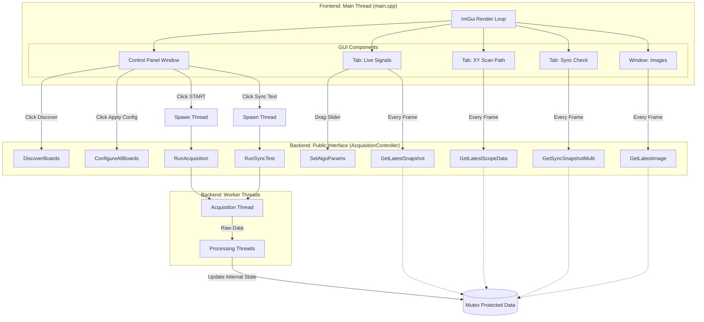
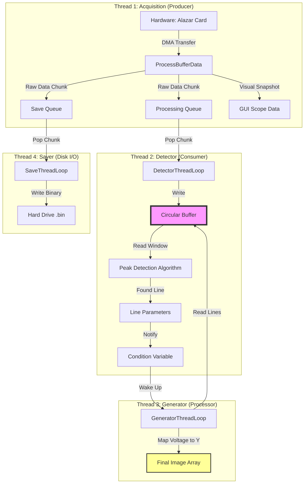

# GUI to Backend Integration Architecture

This document details the connection points between the Frontend (ImGui/DirectX) and the Backend (AcquisitionController). It maps specific UI elements to the underlying C++ logic.

# System Architecture Details

## 1. Detailed Code Mapping: "Which Section Calls What?"

This section outlines the line-by-line connection between the GUI elements in `mainMultiThread.cpp` and the Backend functions in `AcquisitionControllerDetectLine`.

### A. The Control Panel (Left Side)

| User Action | GUI Code | Backend Call | Notes |
| :--- | :--- | :--- | :--- |
| **Clicks "Discover Boards"** | `if (ImGui::Button("Discover Boards"))` | `g_AcqController.DiscoverBoards();` | Initializes hardware handles. |
| **Clicks "Apply Config"** | `if (ImGui::Button("Apply Config"))` | `g_AcqController.ConfigureAllBoards(g_boardConfig);` | Sends settings to Alazar cards. |
| **Clicks "START ACQUISITION"** | `acquisitionThread = std::thread([acq]() { ... });` | `g_AcqController.RunAcquisition(acq);` | **Spawns a new thread** so the GUI doesn't freeze. |

### B. Tab 1: Live Signals (Oscilloscope)

#### Section: "3. DATA FETCHING (SYNCHRONIZED)"
* **Purpose:** To get the waveform (ChA) and the red peak lines simultaneously so they don't jitter relative to each other.
* **Backend Call:** `g_AcqController.GetLatestSnapshot(snapshotWave, snapshotPeaks);`
* **Internal Mechanism:** This function locks `m_guiDataMutex`, copies `m_guiSnapshotWaveform` and `m_guiSnapshotPeaks`, and unlocks.

#### Section: "B. Plot Other Channels" (ChB, ChC, ChD)
* **Purpose:** To get the raw data for M1 (Fast), M2 (Slow), or Aux channels.
* **Backend Call:** `g_AcqController.GetLatestScopeData(data, boardID, channelIndex);`

#### Section: "Algorithm Tuning" (Sliders)
* **Purpose:** To update the peak detection thresholds in real-time.
* **Backend Call:** `g_AcqController.SetAlgoParams(tHigh, tLow, tDist);`

### C. Tab 2: XY Scan Path (The Maze)

#### Section: "2. FETCH DATA"
* **Purpose:** To get X and Y data arrays to plot against each other.
* **Backend Call:** `g_AcqController.GetLatestScopeData(dataX, ...)` and `GetLatestScopeData(dataY, ...)`
* **Note:** This reuses the generic "Scope Data" getter but maps it to X and Y axes in the plot based on user selection.

### D. Tab 3: Sync Check

#### Section: "2. FETCH DATA & STATUS"
* **Purpose:** To see the results of the "One-Shot" synchronization test.
* **Backend Call:** `g_AcqController.GetSyncSnapshotMulti(boardID, channelID, ...)`
* **Mechanism:** Accesses the specific `m_syncSnapshots` map populated by `RunSyncTest`.

### E. Floating Window: Images (Heatmap)

#### Function: `DrawImagesWindow()`
* **Purpose:** To retrieve the fully constructed 2D image (1024x1024).
* **Backend Call:** `g_AcqController.GetLatestImage(image2D);`
* **Mechanism:** This copies the `m_finalImage` array (filled by the Generator Thread) into a local vector for ImPlot to render.

---

## 2. Core Function Definitions

Below is a breakdown of the critical functions responsible for managing the data pipeline.

### `RunAcquisition` (The Start Button)
* **Role:** Main Entry Point
* **Function:** Arms the hardware, configures DMA buffers, and enters the primary `while()` loop that waits for the hardware to signal "Buffer Full." It serves as the heartbeat of the ingestion process.

### `ProcessBufferData` (The Mail Sorter)
* **Role:** Raw Data Router
* **Function:** Called immediately when a DMA transfer completes. It performs three critical tasks:
    1.  De-interleaves the raw multiplexed stream into Channels A, B, C, and D.
    2.  Updates the thread-safe vectors for the "Live Signals" GUI.
    3.  Packages the data into `DataChunk` structs and pushes them into the `ProcessingQueue` and `SaveQueue`.

### `DetectorThreadLoop` (The Gatekeeper / Consumer)
* **Role:** Circular Buffer Manager & Analyst
* **Function:** This thread sits in a loop waiting for data from the `ProcessingQueue`.
    * **Writes:** It copies new data into the **Circular Buffer** (Ring Memory), handling the wrap-around logic.
    * **Analyzes:** It runs the Peak Detection algorithm on Channel B (Fast Axis) to identify the start and stop indices of every scan line.
    * **Notifies:** Once lines are found, it signals the Generator Thread.

### `GeneratorThreadLoop` (The Painter)
* **Role:** Image Reconstruction
* **Function:** This thread sleeps until notified by the Detector.
    * **Reads:** It looks into the Circular Buffer using the indices provided by the Detector.
    * **Processes:** It grabs the pixels for a specific line, applies Bidirectional Reversal (if necessary), and maps the data to the correct Y-row based on the Channel C voltage.
    * **Outputs:** Writes the final pixels to the 2D `m_finalImage` array for the Heatmap display.

### `SaveThreadLoop` (The Archivist)
* **Role:** Disk I/O
* **Function:** A completely independent thread that pulls data from the `SaveQueue` and streams binary data to the SSD. It runs at a lower priority to ensure that file saving never blocks the live viewing or acquisition processes.

### `FindLagByXCorr` (The Synchronizer)
* **Role:** Calibration Math
* **Function:** Performs a Cross-Correlation calculation between two signals (usually Channel A from two different boards). It returns the integer sample delay (Lag) required to align the boards perfectly.

### `GetLatestScopeData` / `GetLatestImage` (The Reporters)
* **Role:** GUI Accessors
* **Function:** Thread-safe "Getter" functions that lock mutexes and return copies of the current data state. These allow the GUI (ImGui/DirectX) to render at 60 FPS without crashing the high-speed acquisition threads.

---

## 3. The Threading Model Summary

* **Main Thread (GUI):** Runs `main.cpp`. It owns the `g_AcqController` object. It **polls** (asks for) data every frame (60 times a second).
* **Acquisition Thread:** Spawned when you click "Start". It runs `RunAcquisition`. It pumps data from hardware to the Controller's queues.
* **Helper Threads (Detector/Generator/Save):** Created inside the `AcquisitionController` constructor. They process data in the background and update the variables that the GUI eventually reads.


## 1. System Architecture Diagram


[Image of software architecture diagram]





## 2. Data Flow Diagram

The system follows a **Producer-Consumer** pattern with detached processing threads to ensure zero-latency acquisition.




# Circular Buffer Architecture

## 1. Overview
The core of this data acquisition software is a **Circular Buffer** (or Ring Buffer). This data structure acts as a high-speed, temporary storage reservoir that decouples the hardware (Producer) from the software processing (Consumer).

In high-speed laser scanning, data arrives continuously and cannot be paused. If the software pauses to update the GUI or save a file, the hardware must have a place to continue dumping data, or that data is lost forever. The circular buffer provides this "safety margin."

---

## 2. Architecture: The Producer-Consumer Model

The system is designed as a pipeline with three distinct stages. Data flows through these stages using memory buffers to ensure no stage blocks the others.

### Stage 1: The Producer (Hardware & DMA)
* **Source:** AlazarTech ATS9440 Digitizer.
* **Mechanism:** Direct Memory Access (DMA). The card writes directly into PC RAM without CPU intervention.
* **Unit of Transfer:** A "Buffer" (or Block). The card does not send individual samples; it fills a large block of memory (e.g., 8MB) and triggers an interrupt when full.
* **Variable:** `buffersPerAcquisition` determines how many of these blocks are captured (set to infinite/continuous for live scanning).

### Stage 2: The Consumer (The Circular Buffer)
* **Location:** `DetectorThreadLoop` in `AcquisitionController.cpp`.
* **Action:** When a DMA Buffer arrives, this thread wakes up, copies the raw data into the **Circular Buffer**, and immediately tells the card "I'm done, you can reuse that DMA memory."
* **Key Logic:** It uses a "Write Head" index to place data. When it reaches the end of the allocated memory, it wraps around to the beginning (index 0).

### Stage 3: The Processors (Peak Detection & Image Gen)
* **Location:** `DetectorThreadLoop` (Analysis) and `GeneratorThreadLoop` (Visualization).
* **Action:** These functions "chase" the Write Head. They read data that has just been written to find signal peaks and construct the image.

---

## 3. Mathematical Configuration & Performance

The stability of the system depends on balancing **Throughput** (Data Rate) vs. **Latency** (CPU Overhead). This balance is controlled by three key variables.

### A. The Atomic Unit: `SamplesPerRecord`
* **Definition:** The number of data points constituting one "unit" of physical reality (e.g., one laser line, or one A-scan).
* **Constraint:** Must be a multiple of the digitizer's memory alignment (usually 64 or 128 bytes).
* **Impact:** If this is too small, you break the image structure. If too large, you capture dead time between triggers.

### B. The Transfer Block: `RecordsPerBuffer`
* **Definition:** How many "Lines" or "Records" are bundled together into one DMA transfer interrupt.
* **The Math of CPU Load:** Every time a buffer fills, the CPU receives an interrupt to process `ProcessBufferData`.
    * **Scenario 1 (Too Small):**
        * 1 Record per Buffer at 100 kHz Trigger Rate.
        * Interrupt Rate: 100,000 times/second.
        * **Result:** **API Failure / System Freeze.** The CPU spends 100% of its time entering/exiting interrupt handlers (Context Switching) and has zero time to actually process the data.
    * **Scenario 2 (Too Large):**
        * 10,000 Records per Buffer.
        * Update Rate: Once every 10 seconds.
        * **Result:** **High Latency.** The GUI looks frozen because it only updates huge chunks at a time. The Circular Buffer must be massive to hold this surge of data.
    * **Scenario 3 (Optimal):**
        * Target an interrupt rate of roughly **60 Hz to 100 Hz** (video frame rate).
        * Formula: $$N_{records} \approx \frac{\text{Trigger Frequency (Hz)}}{\text{Target Update Rate (Hz)}}$$

### C. The Reservoir: `CIRC_BUFFER_SIZE`
* **Definition:** The total size of the software ring buffer (`m_cb_Img`).
* **Formula:** $$\text{Total Size} = \text{SegmentsPerBuffer} \times \text{BufferCount}$$
* **The Math of Overflow:**
    If your processing algorithms (Peak Detection + Saving) are slower than the incoming data rate, the **Write Head** will eventually lap the **Read Pointer**.
    * **Time to Overflow:** $$T_{safety} = \frac{\text{Buffer Size (MB)}}{\text{Data Rate (MB/s)} - \text{Processing Rate (MB/s)}}$$
    * If Processing Rate > Data Rate, the buffer never overflows.
    * If Processing Rate < Data Rate, $T_{safety}$ is how long you can run before data corruption occurs.

---

## 4. Circular Buffer Implementation Details

### How it works in Code
The buffer is a standard `std::vector` (linear memory). We create the "circular" behavior using the **Modulo Operator (`%`)**.

#### 1. Writing Data (The Producer Logic)
Inside `DetectorThreadLoop`, new data arrives in `chunk.chA`. We copy it to the main buffer `m_cb_Img` at the position `m_cb_write_head`.

```cpp
// 1. Calculate where to write
size_t samples_to_write = chunk.chA.size();

for (int i = 0; i < samples_to_write; i++) {
    // 2. Modulo (%) ensures we wrap from Index 999 back to 0
    size_t circular_index = (m_cb_write_head + i) % CIRC_BUFFER_SIZE;
    
    // 3. Write data
    m_cb_Img[circular_index] = chunk.chA[i];
}

// 4. Advance the head
m_cb_write_head = (m_cb_write_head + samples_to_write) % CIRC_BUFFER_SIZE;
```


#### 2. Reading Data (The Consumer Logic)
graph TD
    %% Define the Incoming Data Source
    subgraph Producer [Producer: DetectorThreadLoop]
        Chunk[Incoming Data Chunk<br/>(e.g., 4096 samples from Queue)]
    end

    %% Define the Circular Buffer Structure
    subgraph CircularBuffer ["The Circular Buffer (m_cb_Img)"]
        direction LR
        %% Conceptualizing linear memory as segments for visualization
        MemStart[Index 0] --- MemOld[Processed Data] --- MemReadGen[Generator Reading Here] --- MemReadDet[Detector Reading Here] --- MemWrite[Write Head <br/>(Currently Writing)] --- MemEmpty[Free Space] --- MemEnd["Index N-1<br/>(CIRC_BUFFER_SIZE)"]
        
        %% The crucial Wrap-Around link
        MemEnd -.->|"Wrap-Around Logic (%)"| MemStart
    end

    %% Define Pointers/Heads
    WriteHead(m_cb_write_head) --> MemWrite
    ReadGenPtr(Generator Read Ptr) --> MemReadGen
    ReadDetPtr(Detector Read Ptr) --> MemReadDet

    %% Data Flow Action
    Chunk -->|"memcpy into buffer<br/>at write_head index"| MemWrite

    %% Styling for visual clarity
    classDef memory fill:#e1e1e1,stroke:#333,stroke-width:2px;
    classDef activeWrite fill:#9f9,stroke:#333,stroke-width:2px;
    classDef activeRead fill:#ccf,stroke:#333,stroke-width:2px;
    classDef processed fill:#f9f,stroke:#333,stroke-width:1px,stroke-dasharray: 5 5;

    class MemStart,MemEmpty,MemEnd memory;
    class MemWrite activeWrite;
    class MemReadGen,MemReadDet activeRead;
    class MemOld processed; 
 ```