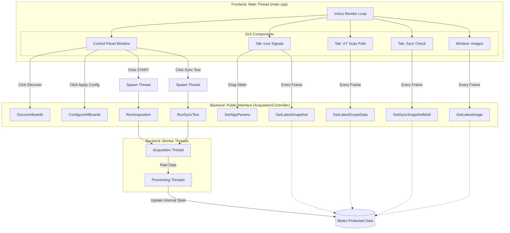
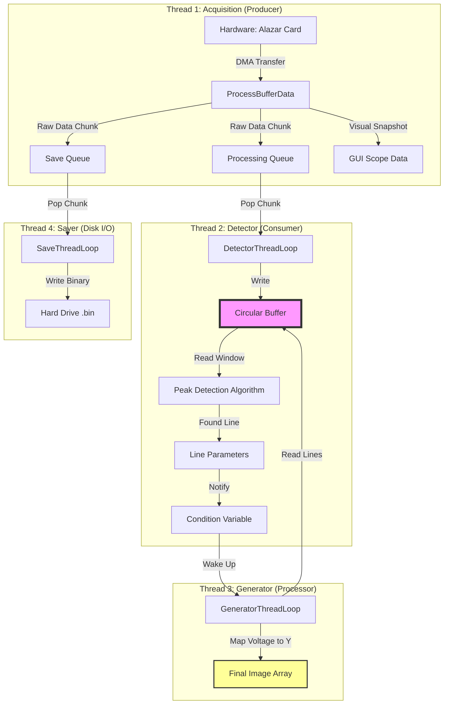

# GUI to Backend Integration Architecture

This document details the connection points between the Frontend (ImGui/DirectX) and the Backend (AcquisitionController). It maps specific UI elements to the underlying C++ logic.

## 1. System Architecture Diagram


[Image of software architecture diagram]




# Architecture Overview: High-Speed Acquisition System

This document outlines the data flow and function roles within the `AcquisitionController` class, specifically focusing on the Circular Buffer implementation and threading model.

## 1. Data Flow Diagram

The system follows a **Producer-Consumer** pattern with detached processing threads to ensure zero-latency acquisition.




# Technical Documentation: High-Speed Circular Buffer Architecture

## 1. Overview
The core of this data acquisition software is a **Circular Buffer** (or Ring Buffer). This data structure acts as a high-speed, temporary storage reservoir that decouples the hardware (Producer) from the software processing (Consumer).

In high-speed laser scanning, data arrives continuously and cannot be paused. If the software pauses to update the GUI or save a file, the hardware must have a place to continue dumping data, or that data is lost forever. The circular buffer provides this "safety margin."

---

## 2. Architecture: The Producer-Consumer Model

The system is designed as a pipeline with three distinct stages. Data flows through these stages using memory buffers to ensure no stage blocks the others.

### Stage 1: The Producer (Hardware & DMA)
* **Source:** AlazarTech ATS9440 Digitizer.
* **Mechanism:** Direct Memory Access (DMA). The card writes directly into PC RAM without CPU intervention.
* **Unit of Transfer:** A "Buffer" (or Block). The card does not send individual samples; it fills a large block of memory (e.g., 8MB) and triggers an interrupt when full.
* **Variable:** `buffersPerAcquisition` determines how many of these blocks are captured (set to infinite/continuous for live scanning).

### Stage 2: The Consumer (The Circular Buffer)
* **Location:** `DetectorThreadLoop` in `AcquisitionController.cpp`.
* **Action:** When a DMA Buffer arrives, this thread wakes up, copies the raw data into the **Circular Buffer**, and immediately tells the card "I'm done, you can reuse that DMA memory."
* **Key Logic:** It uses a "Write Head" index to place data. When it reaches the end of the allocated memory, it wraps around to the beginning (index 0).

### Stage 3: The Processors (Peak Detection & Image Gen)
* **Location:** `DetectorThreadLoop` (Analysis) and `GeneratorThreadLoop` (Visualization).
* **Action:** These functions "chase" the Write Head. They read data that has just been written to find signal peaks and construct the image.

---

## 3. Mathematical Configuration & Performance

The stability of the system depends on balancing **Throughput** (Data Rate) vs. **Latency** (CPU Overhead). This balance is controlled by three key variables.

### A. The Atomic Unit: `SamplesPerRecord`
* **Definition:** The number of data points constituting one "unit" of physical reality (e.g., one laser line, or one A-scan).
* **Constraint:** Must be a multiple of the digitizer's memory alignment (usually 64 or 128 bytes).
* **Impact:** If this is too small, you break the image structure. If too large, you capture dead time between triggers.

### B. The Transfer Block: `RecordsPerBuffer`
* **Definition:** How many "Lines" or "Records" are bundled together into one DMA transfer interrupt.
* **The Math of CPU Load:** Every time a buffer fills, the CPU receives an interrupt to process `ProcessBufferData`.
    * **Scenario 1 (Too Small):**
        * 1 Record per Buffer at 100 kHz Trigger Rate.
        * Interrupt Rate: 100,000 times/second.
        * **Result:** **API Failure / System Freeze.** The CPU spends 100% of its time entering/exiting interrupt handlers (Context Switching) and has zero time to actually process the data.
    * **Scenario 2 (Too Large):**
        * 10,000 Records per Buffer.
        * Update Rate: Once every 10 seconds.
        * **Result:** **High Latency.** The GUI looks frozen because it only updates huge chunks at a time. The Circular Buffer must be massive to hold this surge of data.
    * **Scenario 3 (Optimal):**
        * Target an interrupt rate of roughly **60 Hz to 100 Hz** (video frame rate).
        * Formula: $$N_{records} \approx \frac{\text{Trigger Frequency (Hz)}}{\text{Target Update Rate (Hz)}}$$

### C. The Reservoir: `CIRC_BUFFER_SIZE`
* **Definition:** The total size of the software ring buffer (`m_cb_Img`).
* **Formula:** $$\text{Total Size} = \text{SegmentsPerBuffer} \times \text{BufferCount}$$
* **The Math of Overflow:**
    If your processing algorithms (Peak Detection + Saving) are slower than the incoming data rate, the **Write Head** will eventually lap the **Read Pointer**.
    * **Time to Overflow:** $$T_{safety} = \frac{\text{Buffer Size (MB)}}{\text{Data Rate (MB/s)} - \text{Processing Rate (MB/s)}}$$
    * If Processing Rate > Data Rate, the buffer never overflows.
    * If Processing Rate < Data Rate, $T_{safety}$ is how long you can run before data corruption occurs.

---

## 4. Circular Buffer Implementation Details

### How it works in Code
The buffer is a standard `std::vector` (linear memory). We create the "circular" behavior using the **Modulo Operator (`%`)**.

#### 1. Writing Data (The Producer Logic)
Inside `DetectorThreadLoop`, new data arrives in `chunk.chA`. We copy it to the main buffer `m_cb_Img` at the position `m_cb_write_head`.

```cpp
// 1. Calculate where to write
size_t samples_to_write = chunk.chA.size();

for (int i = 0; i < samples_to_write; i++) {
    // 2. Modulo (%) ensures we wrap from Index 999 back to 0
    size_t circular_index = (m_cb_write_head + i) % CIRC_BUFFER_SIZE;
    
    // 3. Write data
    m_cb_Img[circular_index] = chunk.chA[i];
}

// 4. Advance the head
m_cb_write_head = (m_cb_write_head + samples_to_write) % CIRC_BUFFER_SIZE;